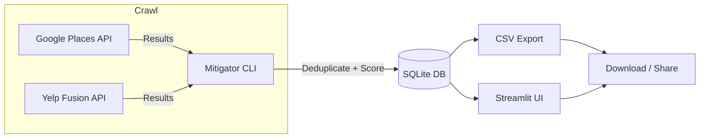

# Mitigation Company Finder

A Python-based tool for discovering, deduplicating, scoring, and viewing mitigation service providers (fire, water, mold remediation, etc.) in a defined service area.

## Features

* **Data collection** from Google Places API and Yelp Fusion API.
* **Deduplication** across multiple sources using phone, website, or name+location matching.
* **Scoring algorithm** that ranks companies based on ratings, reviews, permits, years in business, and license status.
* **Local SQLite database** storage.
* **Streamlit dashboard** for interactive browsing, filtering, and exporting of results.
* **Makefile commands** for one-line workflows.

---

## Prerequisites

* **Python 3.10+**
* **WSL** (Ubuntu recommended) if on Windows.
* API keys:

  * [Google Places API](https://developers.google.com/maps/documentation/places/web-service/overview)
  * [Yelp Fusion API](https://fusion.yelp.com/)

---

## Setup

### 1. Clone the repository

```bash
git clone <repo-url> mitigation-finder
cd mitigation-finder
```

### 2. Create environment & install dependencies

```bash
make venv
```

This will:

* Create `.venv/` virtual environment
* Upgrade pip
* Install dependencies in editable mode
* Add Streamlit, Pandas, and SQLAlchemy

---

## Configuration

Create a `.env` file in the project root:

```env
GOOGLE_PLACES_KEY=your_google_places_key
YELP_FUSION_KEY=your_yelp_fusion_key
DB_PATH=./data/mitigation.db
CSV_OUT=./data/companies.csv
```

---

## Usage

### Crawl data

Fetch and score companies for your configured service area:

```bash
make crawl
```

### Launch UI

Run the Streamlit dashboard:

```bash
make ui
```

### Full reset

Clear DB, re-fetch, and launch the UI in one step:

```bash
make reset
```

### Remove database and CSV

```bash
make clean-db
```

---

## Makefile Commands

| Command         | Description                                       |
| --------------- | ------------------------------------------------- |
| `make venv`     | Create venv and install dependencies              |
| `make crawl`    | Run the mitigator to fetch/update companies in DB |
| `make ui`       | Launch Streamlit dashboard                        |
| `make clean-db` | Delete the DB and CSV                             |
| `make reset`    | Clean DB, run crawl, then launch UI               |

You can run these from `src/` by adding `-C ..`:

```bash
make -C .. ui
```

---

## Data Storage

* Database: SQLite at `./data/mitigation.db`
* CSV export: `./data/companies.csv`
* Deduplication is handled automatically on data ingestion.

---

## Scoring

The current score formula:

```
score =
  0.35 * (rating / 5.0) * log1p(review_count) +
  0.35 * norm(permits_24mo) +
  0.15 * norm(years_in_business) +
  0.15 * license_bonus
```

* **rating**: 0-5 stars
* **review\_count**: log-scaled
* **permits\_24mo**: normalized 0-1 within dataset
* **years\_in\_business**: normalized 0-1 within dataset
* **license\_bonus**: 1.0 if active license, else 0

---

## Streamlit Dashboard

The UI lets you:

* Sort by any field (score, rating, reviews, etc.)
* Filter by city, category, score threshold, or free text
* Download filtered results as CSV

Run:

```bash
make ui
```

Then open the URL shown in the terminal (defaults to `http://localhost:8501`).

---

## Data Flow Diagram



---

## Notes

* Crawling will consume API quota for Google Places and Yelp.
* Avoid running too frequently to stay within free limits.
* Data freshness depends on API results; `make crawl` can be run periodically to update scores.

---

## License

MIT License - see [LICENSE](LICENSE) for details.
